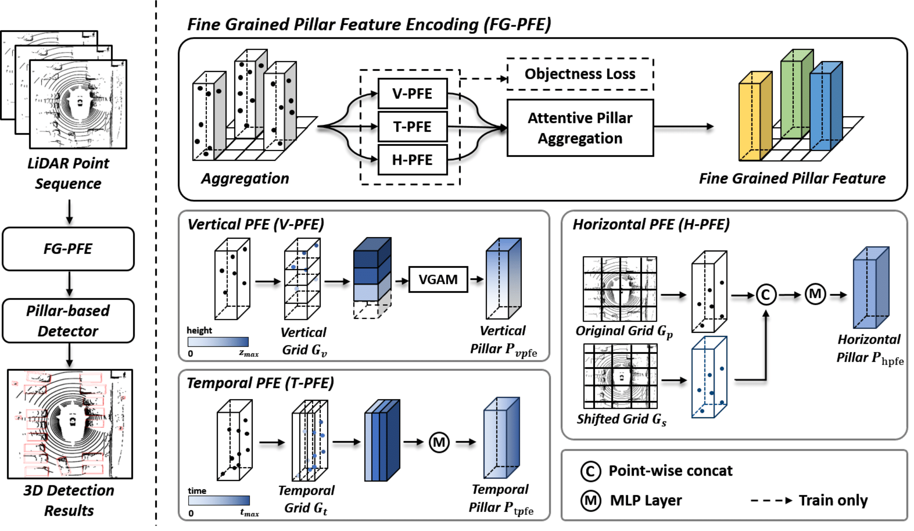

# FG-PFE

---

This is the official implementation of ***FG-PFE***, a new pillar encoding architecture, referred to as Fine-Grained Pillar Feature Encoding (FG-PFE). FG-PFE employs spatio-temporal virtual (STV) grids to capture the distribution of point clouds within each pillar across vertical, temporal, and horizontal dimensions. We implement our method based on PillarNet. The submission is the FG-PFE with a voxel size of (0.075m, 0.075m, 0.2m), including test time augmentation (TTA). The results of an experimental evaluation show that the proposed architecture achieved competitive performance on the nuScenes dataset, with state-of-the-art performances in some 3D object detection benchmark categories.

- **Title**: Fine-Grained Pillar Feature Encoding via Spatio-Temporal Virtual Grid for 3D Object Detection

- **Author**: Konyul Park*, Yecheol Kim*, Junho Koh, Byungwoo Park, and Jun Won Choi (* indicates equal contribution)

- **Conference**: IEEE International Conference on Robotics and Automation (ICRA), 2024.

- **More details**: 

## Abstract

Developing high performance, real-time architectures for LiDAR-based 3D object detectors is essential for the successful commercialization of autonomous vehicles. Among numerous architectures designed for encoding LiDAR point clouds, pillar-based methods are considered as the most suitable for onboard deployment, because of their computational efficiency. However, pillar-based methods sometimes lag behind other point encoding techniques in terms of performance. We claim that current pillar-based methods have not captured the fine-grained distributions of LiDAR points within each pillar well, and thus, there is significant potential for enhancement in the pillar feature encoding step. In this paper, we propose a new pillar encoding architecture, referred to as Fine-Grained Pillar Feature Encoding (FG-PFE). FG-PFE employs spatio-temporal virtual (STV) grids to capture the distribution of point clouds within each pillar across vertical, temporal, and horizontal dimensions. Using STV grids, the points in each pillar are separately encoded by Vertical PFE (V-PFE),  Temporal PFE (T-PFE), and Horizontal PFE (H-PFE) and finally combined via attentive pillar aggregation module.  Our experiments conducted on the nuScenes dataset demonstrate that our FG-PFE achieves significant performance gains over the PointPillar, CenterPoint-Pillar, and PillarNet baselines with a small computational overhead.

  

## Installation
Please refer to [installation.md](docs/installation.md) to install `FG-PFE`.

## Getting Started
Please refer to [getting_started.md](docs/getting_started.md) to prepare nuScenes dataset.

## Main Result
Results on nuScenes *val* set

|    Model   | mAP  |  NDS | Link |
|:----------:|:----:|:----:|:----:|
| [FG-PFE](tools/cfgs/nuscenes_models/fgpfe.yaml) | 60.5 | 68.1 | [GoogleDrive](https://drive.google.com/file/d/1tFnkFC5AxKJiwcxrFSiA_E6bmwKKsmle/view?usp=drive_link) |

## Acknowledgement

- This work is built upon the [**OpenPCDet**](https://github.com/open-mmlab/OpenPCDet). Please refer to the official github repositories, OpenPCDet for more information.
- This README follows the style of **[3D Dual-Fusion](https://github.com/rasd3/3D-Dual-Fusion)**.

## License

This project is released under the Apache 2.0 license.

## Related Repos

1. spconv
2. PillarNet
